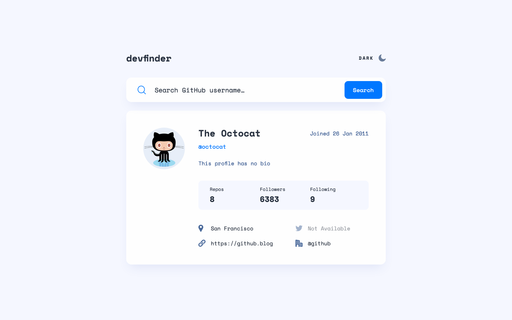
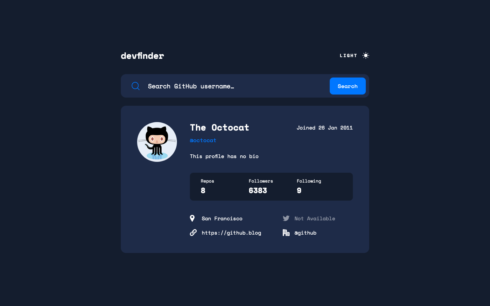

# Frontend Mentor - GitHub user search app solution

This is a solution to the [GitHub user search app challenge on Frontend Mentor](https://www.frontendmentor.io/challenges/github-user-search-app-Q09YOgaH6). Frontend Mentor challenges help you improve your coding skills by building realistic projects. 

## Table of contents

- [Overview](#overview)
  - [The challenge](#the-challenge)
  - [Screenshot](#screenshot)
  - [Links](#links)
- [My process](#my-process)
  - [Built with](#built-with)
  - [What I learned](#what-i-learned)
  - [Useful resources](#useful-resources)
- [Author](#author)

## Overview

### The challenge

Users should be able to:

- View the optimal layout for the app depending on their device's screen size
- See hover states for all interactive elements on the page
- Search for GitHub users by their username
- See relevant user information based on their search
- Switch between light and dark themes
- **Bonus**: Have the correct color scheme chosen for them based on their computer preferences. _Hint_: Research `prefers-color-scheme` in CSS.

### Screenshot

### Links

- Solution URL: [Frontend Mentor]](https://www.frontendmentor.io/solutions/mobile-first-design-using-css-grid-flexbox-scss-jkuh8RGzB3)
- Live Site URL: [Vercel](https://fem-github-user-search-app-sigma.vercel.app/)

## My process

### Built with

- Semantic HTML5 markup
- CSS custom properties
- SCSS
- Flexbox
- CSS Grid
- Javascript
- Mobile-first workflow

### What I learned

I learned about the prefers-color-scheme property and how to use it, as well as using CSS variables with different classes applied to :root in order to easily change themes.

### Useful resources

- [Prefers-Color-Scheme](https://publishing-project.rivendellweb.net/prefers-color-scheme-in-css-and-javascript/) - This site gives a good practical overview of prefers-color-scheme
- [Switch Between Color Schemes with CSS Variables and JavaScript](https://webdesign.tutsplus.com/tutorials/color-schemes-with-css-variables-and-javascript--cms-36989) - Here is a good explanation of how to applies classes to :root in order to be able to switch color schemes and themes on your page.

## Author

- Codepen - [@anglicus](https://codepen.io/anglicus)
- Frontend Mentor - [@anglicus](https://www.frontendmentor.io/profile/anglicus)
- FreeCodeCamp [@anglicus] (https://www.freecodecamp.org/anglicus)